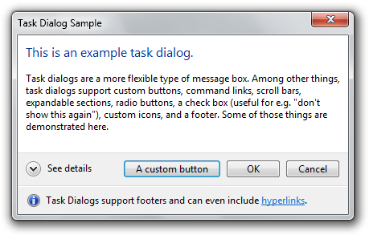
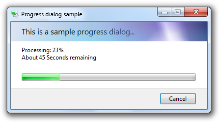
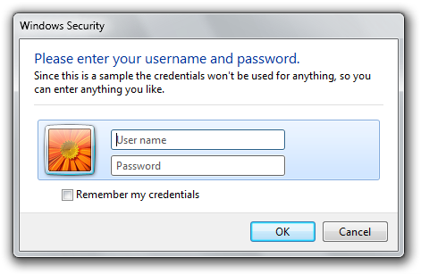
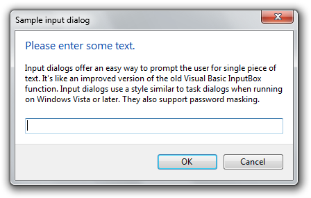
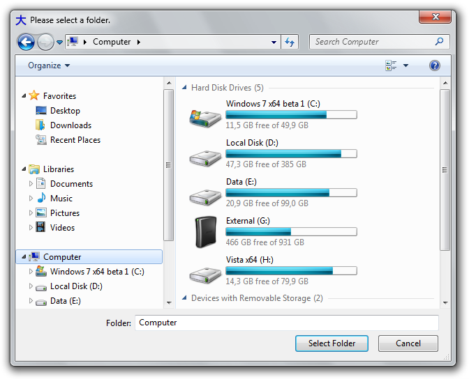

# Ookii.Dialogs

Copyright © Sven Groot (Ookii.org) 2009, see license.txt for details

## Overview

`Ookii.Dialogs` is a class library for .NET applications providing several common dialogs. Included are classes for task dialogs, credential dialogs, progress dialogs, input dialogs, and common file dialogs.

This package contains two class libraries: Ookii.Dialogs.dll for use with Windows Forms, and Ookii.Dialogs.Wpf.dll for use with Windows Presentation Foundation. The classes inside are pretty much identical; only the input dialog is not available for WPF. Some additional utility classes for Windows Forms are provided that are not available for WPF, see below for details.

`Ookii.Dialogs` requires the Microsoft .NET Framework 3.5 SP1 or later. The included source code is intended for use in Visual Studio 2019.

The included sample applications Ookii.Dialogs.Sample and Ookii.Dialogs.Sample.Wpf demonstrate the dialogs for Windows Forms and WPF respectively. View the source of these applications to see how to use the dialogs.

Full reference documentation for the class library is available in the included help file.

## Included dialogs

### Task dialog

Task dialogs are a new type of dialog first introduced in Windows Vista. They provide a superset of the message box functionality.

The `Ookii.Dialogs.TaskDialog` (for Windows Forms) and the `Ookii.Dialogs.Wpf.TaskDialog` (for WPF) classes provide access to the task dialog functionality. The `TaskDialog` class inherits from `System.ComponentModel.Component` and offers full support for the Windows Forms designer and component designer of Visual Studio.

The TaskDialog class requires Windows Vista or a later version of Windows. Windows XP is not supported. Note that it is safe to instantiate the TaskDialog class and set any of its properties; only when the dialog is shown will a NotSupportedException be thrown on unsupported operating systems.

### Progress dialog

Progress dialogs are a common dialog to show progress during operations that may take a long time. They are used extensively in the Windows shell, and an API has been available since Windows 2000.

The `Ookii.Dialogs.ProgressDialog` (for Windows Forms) and the `Ookii.Dialogs.Wpf.ProgressDialog` (for WPF) classes provide a wrapper for the Windows progress dialog API. The `ProgressDialog` class inherits from `System.ComponentModel.Component` and offers full support for the Windows Forms designer and component designer of Visual Studio. The ProgressDialog class resembles the `System.ComponentModel.BackgroundWorker` class and can be used in much the same way as that class.

The progress dialog's behaviour of the `ShowDialog` function is slightly different than that of other .Net dialogs; please read the reference documentation for more information. It is recommended to use a non-modal dialog with the `Show` function.

The `ProgressDialog` class is supported on Windows XP and later versions of Windows. However, the progress dialog has a very different appearance on Windows Vista and later (the image above shows the Vista version), so it is recommended to test on both operating systems to see if it appears to your satisfaction.

When using Windows 7, the ProgressDialog class automatically provides progress notification in the application's task bar button.

### Credential dialog

The `Ookii.Dialogs.CredentialDialog` (for Windows Forms) and the `Ookii.Dialogs.Wpf.CredentialDialog` (for WPF) classes provide wrappers for the CredUI functionality first introduced in Windows XP. This class provides functionality for saving and retrieving generic credentials, as well as displaying the credential UI dialog. This class does not support all functionality of CredUI; only generic credentials are supported, thing such as domain credentials or alternative authentication providers (e.g. smart cards or biometric devices) are not supported.

The CredentialDialog class inherits from `System.ComponentModel.Component` and offers full support for the Windows Forms designer and component designer of Visual Studio.

On Windows XP, the `CredentialDialog` class will use the `CredUIPromptForCredentials` function to show the dialog; on Windows Vista and later, the `CredUIPromptForWindowsCredentials` function is used instead to show the new dialog introduced with Windows Vista. Because of the difference in appearance in the two versions (the image above shows the Vista version), it is recommended to test on both operating systems to see if it appears to your satisfaction.

### Input dialog

The input dialog is a dialog that can be used to prompt the user for a single piece of text. Its functionality is reminiscent of the Visual Basic InputBox function, only with a cleaner API and UI.

The `Ookii.Dialogs.InputDialog` class provides the input dialog functionality for Windows Forms. This class is not available for WPF.

Unlike the other classes in this package, this class is not a wrapper for any existing API; the dialog uses a custom implementation in Windows Forms. This dialog is supported on Windows XP and later versions of windows; on Windows Vista and later, the visual styles API is used to draw the dialog to mimic the appearance of task dialogs, as shown in the image above.

The `InputDialog` class inherits from `System.ComponentModel.Component` and offers full support for the Windows Forms designer and component designer of Visual Studio.

### Vista-style common file dialogs

Windows Vista introduced a new style of common file dialogs. As of .NET 3.5 SP1, the Windows Forms `OpenFileDialog` and SaveFileDialog class will automatically use the new style under most circumstances; however, some settings (such as setting `ShowReadOnly` to true) still cause it to revert to the old dialog. The `FolderBrowserDialog` still uses the old style. In WPF, the `Microsoft.Win32.OpenFileDialog` and `SaveFileDialog` classes still use the old style dialogs, and a folder browser dialog is not provided at all.

The `Ookii.Dialogs.VistaOpenFileDialog`, `Ookii.Dialogs.VistaSaveFileDialog` and `Ookii.Dialogs.VistaFolderBrowserDialog` provide these dialogs for Windows Forms (note that in the case of the `OpenFileDialog` and `SaveFileDialog` it is recommended to use the built-in .NET classes unless you hit one of the scenarios where those classes use the old dialogs). The `Ookii.Dialogs.Wpf.VistaOpenFileDialog`, `Ookii.Dialogs.Wpf.VistaSaveFileDialog` and `Ookii.Dialogs.Wpf.VistaFolderBrowserDialog` classes provide the same functionality for WPF.

The classes have been designed to resemble the original Windows Forms and WPF classes to make it easy to switch. When the classes are used on Windows XP, they will automatically fall back to the old style dialog; this is also true for the `VistaFolderBrowserDialog` on WPF; that class provides a complete implementation of a folder browser dialog for WPF, old as well as new style.

The Vista-style file and folder dialogs classes for Windows Forms inherit from `System.ComponentModel.Component` and offer full support for the Windows Forms designer and component designer of Visual Studio.

## Additional functionality for Windows Forms

Three additional classes are provided for Windows Forms only, in the `Ookii.Dialogs` library. These classes are used to support the `InputDialog` (with the exception of the Aero glass functionality, which the `InputDialog` does not use) but are made public for your convenience.

The `AdditionalVisualStyleElements` class provides some visual style elements used by task dialogs on Windows Vista and later.

The `Glass` class provides functionality for extending Aero glass into the client area of a window on Windows Vista and later, and for drawing text on a glass surface.

The `ExtendedForm` class serves as an alternative base class for forms, and provides functionality to automatically use the system font (e.g. Tahoma on XP and Segoe UI on Vista and later), and easy access to some of the functionality of the `Glass` class.
